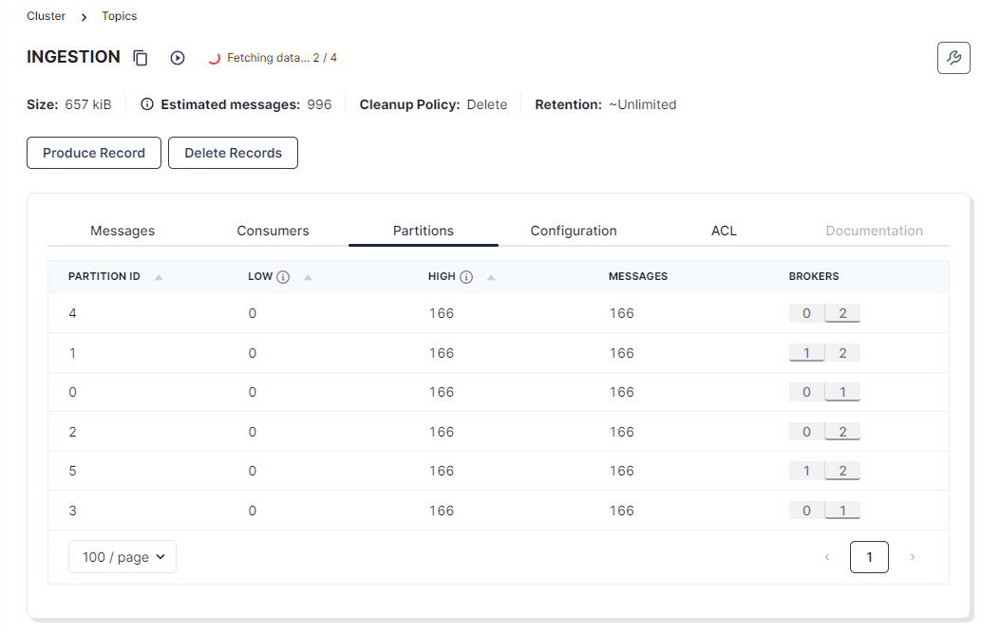
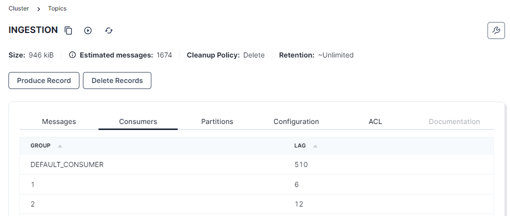

#Lecture 3 solutions

## Exercise 1 - Deploy a Kafka cluster

**Task**: Deploy Kafka using the `helm` and the following [kafka-values.yaml](kafka-values.yaml) file.


```bash
helm install --values kafka-values.yaml kafka oci://registry-1.docker.io/bitnamicharts/kafka --version 30.0.4
```

#### Validate the deployment of Kafka using a simple producer and consumer

**Tasks**: Producing and consuming topic messages

1. Create a Kafka client pod (`docker.io/bitnami/kafka:3.8.0-debian-12-r3`) using `kubectl run`.

```bash
kubectl run kafka-client --restart='Never' --image docker.io/bitnami/kafka:3.8.0-debian-12-r3  --command -- sleep infinity
```

2. Open two terminals and attach to the Kafka client pod using `kubectl exec` command.

```bash
kubectl exec --tty -i kafka-client -- bash
```

3. Run the following commands in the first terminal to produce messages to the Kafka topic `test`:

```bash
kafka-console-producer.sh --bootstrap-server kafka:9092 --topic test
```

**Output**:
```
D:\Programmer\GitHub Repositories\BigDataCourseExercises\lectures\03>kubectl exec --tty -i kafka-client -- bash
I have no name!@kafka-client:/$ kafka-console-producer.sh --bootstrap-server kafka:9092 --topic test
>Hej
>Dette er text
>345324564578469
```

4. Run the following commands in the second terminal to consume messages from the Kafka topic `test`:

```
kafka-console-consumer.sh --bootstrap-server kafka:9092 --topic test --from-beginning
```

**Output**:
```
C:\Users\madsw>kubectl exec --tty -i kafka-client -- bash
I have no name!@kafka-client:/$ kafka-console-consumer.sh --bootstrap-server kafka:9092 --topic test --from-beginning
Hej
Dette er text
345324564578469
```


### Exercise 2 - Additional deployments of Kafka Connect, Kafka Schema Registry, and Kafka KSQL

1. Apply the Kafka Schema Registry manifest file to your namespace. ```bash kubectl apply -f kafka-schema-registry.yaml ```
1. Apply the Kafka Connect module to your namespace. ```bash kubectl apply -f kafka-connect.yaml```
1. Apply the Kafka Ksqldb server to your namespace. ```bash kubectl apply -f kafka-ksqldb.yaml```
1. Toggle the following values in the redpanda config map ([redpanda.yaml](./redpanda.yaml)) to enable Kafka modules.
    - `KAFKA_SCHEMAREGISTRY_ENABLED`=`true`
    - `CONNECT_ENABLED`=`true`

- Registry (kafka-schema-registry)
  - `kubectl port-forward svc/kafka-schema-registry 8081`. Make a `curl` cmd in a terminal using the URL [http://127.0.0.1:8081](http://127.0.0.1:8081) and get this output:
    
    ```bash
    curl http://127.0.0.1:8081
    {}%                                  
    ```

- Connect (kafka-connect)
  - `kubectl port-forward svc/kafka-connect 8083`. Make a `curl` cmd in a terminal using the URL [http://127.0.0.1:8083](http://127.0.0.1:8083) and get this output:
    
    ```bash
    curl http://127.0.0.1:8083
    {"version":"7.3.1-ce","commit":"a453cbd27246f7bb","kafka_cluster_id":"<kafka_cluster_id>"}%                                    
    ```

- KsqlDB (kafka-ksqldb-server) and KsqlDB CLI (kafka-ksqldb-cli)
  - `kubectl exec --stdin --tty deployment/kafka-ksqldb-cli -- ksql http://kafka-ksqldb-server:8088` and get this output:

    ```bash
                      
                      ===========================================
                      =       _              _ ____  ____       =
                      =      | | _____  __ _| |  _ \| __ )      =
                      =      | |/ / __|/ _` | | | | |  _ \      =
                      =      |   <\__ \ (_| | | |_| | |_) |     =
                      =      |_|\_\___/\__, |_|____/|____/      =
                      =                   |_|                   =
                      =        The Database purpose-built       =
                      =        for stream processing apps       =
                      ===========================================

    Copyright 2017-2022 Confluent Inc.

    CLI v7.3.1, Server v7.3.1 located at http://kafka-ksqldb-server:8088
    Server Status: RUNNING

    Having trouble? Type 'help' (case-insensitive) for a rundown of how things work!

    ksql> 
    ```

### Exercise 3 - The Redpanda console

**Task**: Deploy Redpanda using manifest file [redpanda.yaml](./redpanda.yaml) with the following command:

```bash
kubectl apply -f redpanda.yaml
```

**Task**: Access Redpanda using the following command: `kubectl port-forward svc/redpanda 8080` to open [Redpanda](http://127.0.0.1:8080) in your browser!

**Task**: Explore the following tabs:

- [Overview](http://127.0.0.1:8080/overview)
- [Topics](http://127.0.0.1:8080/topics)
- [Schema Registry](http://127.0.0.1:8080/schema-registry)
- [Kafka Connectors](http://127.0.0.1:8080/connect-clusters/Connectors)


### Exercise 4 - Produce messages to Kafka using Python

**Tasks**: Think about what properties you want for the `INGESTION` topic:

- How many partitions will you have for the `INGESTION` topic?
- Which replication factor will you use for the `INGESTION` topic?
- Which min in-sync replicas will you use for the `INGESTION` topic?
- What would be an appropriate retention time for the `INGESTION` topic?
- What would be an appropriate retention size for the `INGESTION` topic?

**Task**: Create the `INGESTION` topic with your chosen properties.

**Task**: Question: Which property will be possible if you add a key, which defines the sensor id, to each record?

**Task**: Update your program from [lecture 2 exercise 8](../02/README.md#exercise-10---create-six-fictive-data-sources) to produce sensor samples directly to Kafka.

**Hint**: If you did not create a program then use the scripts [./hints/*.py](./hints).

**Output**:
```
{'payload': '{"sensor_id": 1, "modality": -405, "unit": "MW", "temporal_aspect": "real_time"}', 'correlation_id': '2846eebb-155c-4409-9885-efb395bfeef2', 'created_at': 1727026679.322013, 'schema_version': 1}
{'payload': '{"sensor_id": 5, "modality": 11, "unit": "MW", "temporal_aspect": "real_time"}', 'correlation_id': 'ff8e12a2-4bac-4931-9cf6-911cc22de6ee', 'created_at': 1727026679.358751, 'schema_version': 1}
{'payload': '{"sensor_id": 6, "modality": -355, "unit": "MW", "temporal_aspect": "real_time"}', 'correlation_id': '2c124674-93f4-43e9-923e-43926da39991', 'created_at': 1727026679.399657, 'schema_version': 1}
{'payload': '{"sensor_id": 3, "modality": 102, "unit": "MW", "temporal_aspect": "real_time"}', 'correlation_id': '8260146f-f3f3-4fa6-a36f-bd171fda10d3', 'created_at': 1727026679.437058, 'schema_version': 1}
{'payload': '{"sensor_id": 2, "modality": 513, "unit": "MW", "temporal_aspect": "real_time"}', 'correlation_id': '228dfdf4-08fc-4ba1-b84d-d416305e16d6', 'created_at': 1727026679.473701, 'schema_version': 1}
{'payload': '{"sensor_id": 4, "modality": -509, "unit": "MW", "temporal_aspect": "real_time"}', 'correlation_id': '5b78b104-69de-4f55-bf00-6ef65a0af999', 'created_at': 1727026679.515263, 'schema_version': 1}
```

**Verification**: To verify that the program is producing messages to the `INGESTION` topic. Open Redpanda console: [localhost:8080/topics/INGESTION](http://127.0.0.1:8080/topics/INGESTION?p=-1&s=50&o=-1#messages).




### Exercise 5 - Consume messages from Kafka using Python with single and multiple consumers

**Task**: Create a consumer program and run it in the terminal in your interactive container.

**Command**: ``` python simple-consumer.py 1 ```

**Output**:
```
root@interactive:/home/root/code/03/Solution# python simple-consumer.py 1
group_id=1
PackageObj(payload=SensorObj(sensor_id=4, modality=-236, unit='MW', temporal_aspect='real_time'), correlation_id='7a06e4d8-653a-4133-a167-66fa6970eb6c', created_at=1727026676.434048, schema_version=1)
PackageObj(payload=SensorObj(sensor_id=4, modality=-183, unit='MW', temporal_aspect='real_time'), correlation_id='b4c12bb6-a5b0-421d-b42e-106b102cef2f', created_at=1727026677.453294, schema_version=1)
PackageObj(payload=SensorObj(sensor_id=4, modality=17, unit='MW', temporal_aspect='real_time'), correlation_id='a8899406-7da5-49fb-b3bc-46c7f5765323', created_at=1727026678.489819, schema_version=1)
PackageObj(payload=SensorObj(sensor_id=4, modality=-509, unit='MW', temporal_aspect='real_time'), correlation_id='5b78b104-69de-4f55-bf00-6ef65a0af999', created_at=1727026679.515263, schema_version=1)
```

**Task**: Start another consumer but with a different group id in your interactive container. What happens when you run the program?

A new group is created and gets assigned members i.e. partitions of the INGESTION topic 



**Task**: Open [localhost:8080/topics/INGESTION](http://127.0.0.1:8080/topics/INGESTION#consumers). You should now see a table similar to the one below. What does the Lag column mean?
    - How far behind the group is on reading new data

**Task**: Questions:

- How can we get two consumers to receive identical records? \\
    Create two kafkaConsumer objects with no specific partition assignment arguments given. Auto assigner assigns all partitions to all groups. 
- How can we get two consumers to receive unique records?
    Yes if we speciffy assignment by [KafkaConsumer.assign(*partitions*)](https://kafka-python.readthedocs.io/en/master/apidoc/KafkaConsumer.html#kafka.KafkaConsumer.assign)
- What defines the maximum number of active parallel consumers within one consumer group?
    Number of partitions in topic.